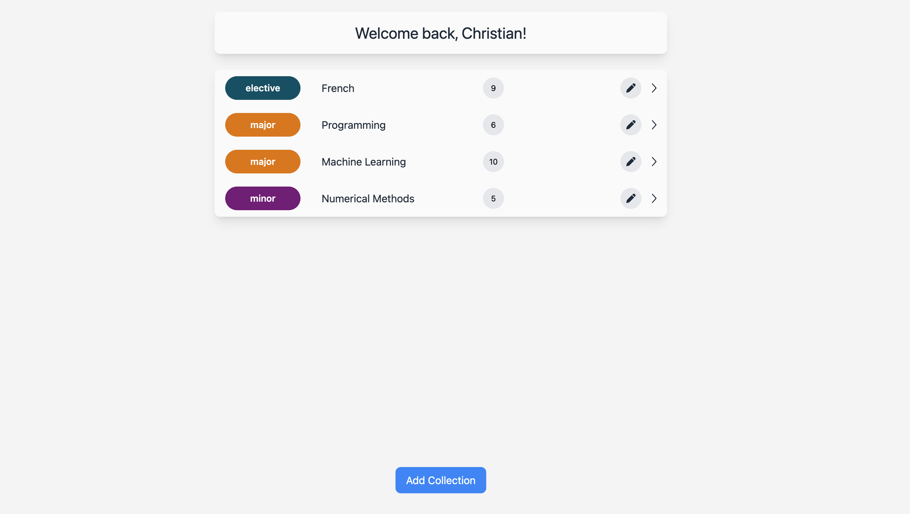
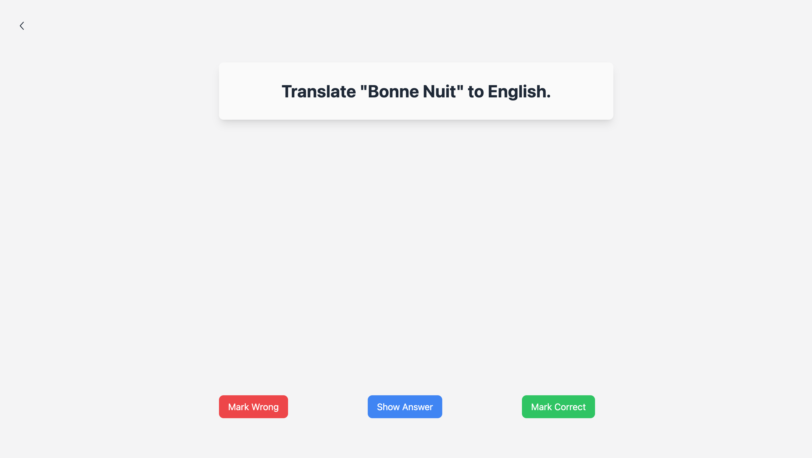

# Flashcards

## Table of Contents

- [Prerequisites](#prerequisites)
- [Installation & Setup](#installation--setup)
- [Introduction](#introduction)
- [Technology Stack](#technology-stack)
- [Features](#features)
- [Usage & Screenshots](#usage--screenshots)
   - [Database](#lets-start-with-the-database)
   - [Migrations & Seeders](#migrations--seeders)
   - [Models](#models)
   - [Repositories](#repositories)
   - [Services](#services)
   - [Controllers](#controllers)
   - [Interceptors](#interceptors)
   - [Views](#views)
- [Future Improvements & Fixes](#future-improvements--fixes)

## Prerequisites

- Java 17 or higher
- Maven
- MySQL

## Installation & Setup

Follow these steps to get the application up and running:

1. **Clone the repository**

   ```
   git clone https://github.com/ChristianDaher/flashcards.git
   ```

2. **Navigate to the project directory**

   ```
   cd flashcards
   ```

3. **Build the project**

   ```
   mvn clean install
   ```

4. **Create a MySQL database**

   ```
   CREATE DATABASE flashcards
   ```

5. **Update application.properties**

   Open the `application.properties` file and update the MySQL properties to match your environment.

6. **Run the application**

   ```
   mvn spring-boot:run
   ```

If all is working correctly, the database should now have a couple of tables and records inside each table.

The application should now be running on `localhost:8080` by default. Check the terminal logs to ensure there are no errors.

## Introduction

Flashcards is a dynamic web application designed to enhance the learning experience by enabling the creation and utilization of customizable flashcards. These flashcards can be organized into collections and categories, providing a structured approach to learning.

This application serves as a versatile tool for self-assessment, allowing users to create flashcards on any topic of their choice. It's not just limited to academic learning; it can be used for a wide range of subjects, from language learning to professional skill development.

The user-friendly interface ensures a seamless experience, making it easy for anyone to create, manage, and review flashcards. With Flashcards, you can transform the way you learn and make the process more engaging and effective.

### Why flashcards?

Research consistently underscores the efficacy of flashcards as a learning tool. Studies have shown that active recall, a key component of flashcard use, enhances long-term retention. In a seminal study by Roediger and Karpicke (2006), it was demonstrated that the retrieval practice involved in flashcard use significantly improves memory recall compared to passive review methods.

> "Taking a memory test not only assesses what one knows, but also enhances later retention, a phenomenon known as the testing effect. We studied this effect with educationally relevant materials and investigated whether testing facilitates learning only because tests offer an opportunity to restudy material. In two experiments, students studied prose passages and took one or three immediate free-recall tests, without feedback, or restudied the material the same number of times as the students who received tests. Students then took a final retention test 5 min, 2 days, or 1 week later. When the final test was given after 5 min, repeated studying improved recall relative to repeated testing. However, on the delayed tests, prior testing produced substantially greater retention than studying, even though repeated studying increased students' confidence in their ability to remember the material. Testing is a powerful means of improving learning, not just assessing it." - [Roediger and Karpicke (2006)](https://pubmed.ncbi.nlm.nih.gov/16507066/)

Moreover, a meta-analysis by Dunlosky et al. (2013) found that self-testing, a technique inherent in flashcard usage, is one of the most effective strategies for improving long-term retention of information. The process of actively engaging with flashcards stimulates the brain, promoting deeper understanding and knowledge retention.

> "Note that we use the term practice testing here (a) to distinguish testing that is completed as a low-stakes or no-stakes practice or learning activity outside of class from summative assessments that are administered by an instructor in class, and (b) to encompass any form of practice testing that students would be able to engage in on their own. For example, practice testing could involve practicing recall of target information via the use of actual or virtual flashcards, completing practice problems or questions included at the end of textbook chapters, or completing practice tests included in the electronic supplemental materials that increasingly accompany textbooks." - [Dunlosky et al. (2013)](https://pcl.sitehost.iu.edu/rgoldsto/courses/dunloskyimprovinglearning.pdf)

## Technology Stack

- **Backend**: [Spring Boot](https://spring.io/projects/spring-boot) - A powerful framework that simplifies the setup and development of Spring applications. It provides default configurations and a stand-alone environment to run applications.

- **Frontend Templates**: [JSP](https://docs.oracle.com/javaee/5/tutorial/doc/bnagx.html) - JavaServer Pages (JSP) is a technology used for building dynamic web pages based on HTML, XML, or other document types. It is used in this project to manage and render the views.

- **Frontend Design**: [Tailwind CSS](https://tailwindcss.com/) - A utility-first CSS framework that is highly customizable and allows for building modern and responsive designs. It is used in this project for styling the frontend.

- **Database**: [MySQL](https://www.mysql.com/) - An open-source relational database management system. In this project, it is used for data persistence and to perform CRUD operations.

- **Version Control**: [Git](https://git-scm.com/) / [GitHub](https://github.com/) - Git is a distributed version control system that tracks changes to source code. GitHub is a cloud-based hosting service for Git repositories. In this project, they are used for version control and source code management.

- **Build Tool**: [Maven](https://maven.apache.org/) - A build automation tool used primarily for Java projects. In this project, it is used to manage dependencies and build the project.

## Features

- **Data Management**: Perform CRUD (Create, Read, Update, Delete) operations with RESTful APIs on MySQL database. This applies to both Models: Collection & Flashcard.

- **User-Friendly Interface**: The application's navigation is intuitive, using icons and buttons for guidance. Arrows for page navigation, pencils for editing, and bins for deletion.

- **Responsive Design**: The application is designed to be fully responsive. It adapts its layout to different screen sizes, ensuring a seamless user experience on all devices, from desktops to mobile phones. This is made possible by Tailwind CSS, which simplifies responsive design by reducing the need for numerous media queries and CSS selectors.

- **Error Handling**: The application provides robust error handling. It not only presents user-friendly error messages but also logs detailed error information for debugging purposes. Invalid URL navigation is prevented; users attempting to access non-existent routes are redirected to an error page with a clear explanation of the issue.

- **Scalability**: The application is designed with scalability in mind. The well-structured codebase and class-based architecture allow for rapid and straightforward changes. This design makes the addition of new features a seamless process, ensuring the application can grow and evolve over time.

- **Database Migrations & Seeders**: The application uses the Flyway dependency for managing database migrations and seeders. This tool automates the creation of database tables and the insertion of sample data, enabling immediate testing of the application. This approach ensures consistency across different environments and simplifies the process of setting up a new instance of the application.

- **MVC Architecture**: The application follows the Model-View-Controller (MVC) architectural pattern. This design separates the application into three interconnected components, allowing for efficient code organization and modular development. The Model corresponds to the application data and business logic, the View to the user interface and presentation of data, and the Controller to the interface between Model and View.

- **ORM Usage**: The application utilizes the Java Persistence API (JPA), an Object-Relational Mapping (ORM) tool. JPA simplifies data manipulation by converting data between incompatible type systems in relational databases and object-oriented programming languages. This allows the application to interact with the database using object-oriented syntax, which enhances readability and maintainability of the code. The use of JPA also facilitates easier data management and transactions.

## Usage & Screenshots

### Let's start with the [database](#database-diagram) 

This is a straightforward and simple database consisting of only three tables:


1. The `users` table: This table contains multiple `User` entries. Each `User` can have multiple `Collection` entries. Each `User` entry includes attributes such as name, email, and password, which will be used for user authentication when implemented.

2. The `collections` table: This table contains multiple `Collection` entries. Each `Collection` is associated with a single `User` and can have multiple `Flashcard` entries.

3. The `flashcards` table: This table contains multiple `Flashcard` entries. Each `Flashcard` is associated with a single `Collection`. We are storing the timestamp of when a user answers a flashcard for potential future features. Currently, only the `is_correct` attribute is being used to check if the user answered correctly.

### Migrations & Seeders

Migrations and seeders are an integral part of our database management. They are located in the `src/main/resources/db` directory of our project.


- **Migrations**: Migrations are SQL scripts that are responsible for setting up the database schema. They define the structure of the tables, including the columns and their data types. Migrations are run when the project starts up for the first time. They ensure that the database structure is correctly set up.


- **Seeders**: Seeders, on the other hand, are SQL scripts that populate the database with initial data. This data can be anything from test data used during development to default data that the application relies on to function correctly. Like migrations, seeders are also run when the project starts up for the first time.


The combination of migrations and seeders allows us to have a consistent and predictable database setup. This is particularly useful in a team environment, where multiple developers need to have the same database structure and data to work with. It's also beneficial when deploying the application, as it ensures that the database on the production server is set up correctly.

### Models

We have 3 models: [`User.java`](./src/main/java/com/example/flashcards/model/User.java), [`Collection.java`](./src/main/java/com/example/flashcards/model/Collection.java), [`Flashcard.java`](./src/main/java/com/example/flashcards/model/Flashcard.java) that correspond to their respective tables.


- `@Entity`: This annotation indicates that the class is a JPA entity, meaning it should be mapped to a database table.
- `@Id`: This annotation is used to mark the attribute that should be mapped to the primary key column in the corresponding database table.
- `@GeneratedValue(strategy = GenerationType.IDENTITY)`: This annotation is used to specify how the primary key should be generated. The `IDENTITY` strategy means that the persistence provider must assign primary keys for the entity using a database identity column.
- `@Column`: This annotation is used when the attribute name in the entity class is different from the column name in the database table. It allows us to specify the exact column name in the database.
- `@Transient`: This annotation indicates that a field is not persisted in the database, and have no corresponding columns in the table. These are used for calculations once the model is loaded.

### Repositories


Each model is associated with a repository that extends the `JpaRepository` interface. These repositories offer built-in methods for common CRUD operations, eliminating the need for manual implementation. Additionally, they provide a convenient way to create functions that map directly to SQL queries using method naming conventions. For instance, in [`CollectionRepository`](./src/main/java/com/example/flashcards/repository/CollectionRepository.java#L10), the method `List<Collection> findAllByUserId(Long userId);` is designed to accept a `userId` and automatically fetches all collections associated with that user.

### Services


Each model is associated with a service that uses the corresponding repository. These services encapsulate the business logic of our application, keeping it separate from the presentation logic in the controllers and the data access logic in the repositories.

Services use the methods provided by the repositories to interact with the database. They can perform operations that involve multiple steps or depend on the results of previous operations. For example, in [`CollectionService`](./src/main/java/com/example/flashcards/service/CollectionService.java#L69-L77), the method `Collection createCollection(Collection collection, Long userId);` is designed to create a new collection and associate it with a user.

Services also handle error checking and validation. For instance, before creating a new collection, the `createCollection` method might check if a collection with the same name already exists for the user. If it does, the method could throw an exception or return an error message.

By encapsulating the business logic in services, we make our application easier to maintain and test. We can change the implementation of a service without affecting the rest of the application, as long as the service's interface remains the same.

### Controllers

Controllers are responsible for handling incoming HTTP requests and providing a suitable response. They act as an intermediary between the client and the application's business logic encapsulated in the services.

Each model in our application has a corresponding controller that handles requests related to that model. For example, the [`CollectionController`](./src/main/java/com/example/flashcards/controller/CollectionController.java) handles requests related to collections, such as creating a new collection, updating a collection's information, or deleting a collection.

Controllers use the methods provided by the services to perform these operations. For instance, to create a new collection, the `CollectionController` might call the `createCollection` method of the `CollectionService`.

Currently, our application includes two controllers that map directly to the models: [`CollectionController`](./src/main/java/com/example/flashcards/controller/CollectionController.java) and [`FlashcardController`](./src/main/java/com/example/flashcards/controller/FlashcardController.java). 

In future updates, we plan to introduce two additional controllers. The `AuthController` will manage authentication-related tasks, such as user login, logout, and registration. The `UserController` will handle user-specific features, including password updates, email changes, and other user profile modifications.

By separating the handling of HTTP requests and responses from the business logic, controllers make our application more modular and easier to maintain.


In the [`MainController`](./src/main/java/com/example/flashcards/controller/MainController.java), we handle the base path of our application. This means that GET requests to the routes `/`, `/index`, `/home`, and `/controllers` will return the `index.jsp` template, which displays a list of the user's collections grouped by category. As you can see, we call various services within the controller. This approach enhances code maintainability and readability.


In the [`FlashcardController`](./src/main/java/com/example/flashcards/controller/FlashcardController.java), we handle all requests that start with `/collection/{collectionId}/flashcard`. This controller is designed to manage flashcards within a specific collection, identified by `collectionId` in the URL.

For instance, a POST request to `/collection/{collectionId}/flashcard/create` triggers the creation of a new flashcard within the specified collection. This method takes the flashcard data from the request body, creates a new flashcard object, and saves it to the database using the [`FlashcardService`](./src/main/java/com/example/flashcards/service/FlashcardService.java).

By structuring our routes in this way, we can easily manage flashcards within specific collections and ensure that our URLs are intuitive and RESTful.

### Interceptors

Interceptors (A.K.A Middlewares) are used to intercept incoming HTTP requests or outgoing HTTP responses. They provide a way to manipulate these requests and responses before they reach their destination (a controller method) or after they leave their source (a controller method).

In our application, we use interceptors for various purposes. For example, we might have an interceptor that checks if a user is authenticated before allowing them to access certain routes. If the user is not authenticated, the interceptor can stop the request from reaching the controller method and instead send a response with an error message.

Another use case for interceptors could be logging. We could have an interceptor that logs information about every incoming request, such as the request method, the URL, and the IP address of the client.

Interceptors provide a powerful way to add behavior to our application that is not directly related to handling a specific request or response. They help us keep our controllers and services focused on their main responsibilities, making our application more modular and easier to maintain.


Firstly, we have an [`Interceptor Configuration`](./src/main/java/com/example/flashcards/config/InterceptorAppConfig.java) file. This configuration file, which implements the `WebMvcConfigurer` interface, serves as the central hub for our interceptors.

The `WebMvcConfigurer` interface provides a method called `addInterceptors` that we can override to register our interceptors. In this method, we create instances of our interceptors and add them to the `InterceptorRegistry`.

Once we've added these interceptors, we specify which requests they should handle based on the request path. For instance, the [`CollectionInterceptor`](./src/main/java/com/example/flashcards/interceptor/CollectionInterceptor.java) handles all requests that start with `/collection/{collectionId}/`. The `{collectionId}` is a placeholder for any specific collection ID, and the `/**` at the end of the path is a wildcard that matches any sequence of characters. This means that the [`CollectionInterceptor`](./src/main/java/com/example/flashcards/interceptor/CollectionInterceptor.java) will handle requests to any path that starts with `/collection/{collectionId}/`.

However, there is an exception for the route `/collection/create`. This route does not correspond to a specific collection ID, so it is not handled by the [`CollectionInterceptor`](./src/main/java/com/example/flashcards/interceptor/CollectionInterceptor.java).


The [`CollectionInterceptor`](./src/main/java/com/example/flashcards/interceptor/CollectionInterceptor.java) is designed to validate the `collectionId` present in the request URL. It checks if the `collectionId` is valid and corresponds to an existing collection. If the `collectionId` is not valid or the collection does not exist, the request is halted before reaching the controller. Instead, the `error.jsp` page is rendered, displaying a specific error message to inform the user about the issue.

Similarly, the [`FlashcardInterceptor`](./src/main/java/com/example/flashcards/interceptor/FlashcardInterceptor.java) applies the same logic to validate the `flashcardId` present in the request URL. It ensures that the `flashcardId` is valid and corresponds to an existing flashcard within the specified collection. If the `flashcardId` is not valid or the flashcard does not exist, the request is halted and the `error.jsp` page is rendered with an appropriate error message.

This interception process filters incoming requests before they reach the controller, ensuring that only valid requests are processed. This is a crucial part of maintaining the integrity and security of our application, as well as enhancing the user experience.

### Views

Finally, let's discuss the templates we use. After a request successfully passes through the controller, a page is rendered with certain attributes. For instance, the [`MainController`](./src/main/java/com/example/flashcards/controller/MainController.java#L27-L37) returns the `index.jsp` template, along with a user object and the user's collections grouped by category. These attributes are then used within the template to display relevant information to the user. You can find this template at [`index.jsp`](./src/main/webapp/WEB-INF/views/index.jsp).



The index page is the first page users see when they access the web app. Collections are grouped by category, displaying the title of the collection, the number of flashcards in each collection, and options to edit or play a collection.


This is the view users will see if they have no collections.

Let's explore the first collection.


Here, users can edit the collection's information, delete it along with all its flashcards, return to the index page, reset the flashcards status, play the collection, add a flashcard, and edit a flashcard.


To edit a flashcard, users can click on the title or category. It's an input field. Once changes are made, clicking on the pencil icon next to it will save the changes.


This is how it looks after returning to the `index`.

Let's delete a collection.


To delete a flashcard, users can click on the trash icon next to the pencil icon that edits the collection. A modal will pop up to confirm the deletion.


When users want to play a collection, the controller returns the `collection/play.jsp` with a random flashcard from the collection's pool of unanswered flashcards. Users can mark the question right/wrong to proceed to the next flashcard, and have the option to show/hide the answer. Once done, users are redirected to the `collection/view.jsp` where they can reset all the flashcards and play again. Users can see all the flashcards they answered correctly and incorrectly.


This is the `Show Answer` button inside the `collection/play.jsp`.


Clicking on the big + icon in the collection prompts users to fill a form to add a flashcard.


After adding a new flashcard, it automatically appears in the collection and users can directly edit/delete it.


Clicking on the pencil icon of the flashcard allows users to change the form data and click edit to update the flashcard information.


After editing a flashcard, it resets and directly displays the new information.


Clicking on the pencil icon of the flashcard also gives users the option to directly delete the flashcard.


After playing a collection and answering all its flashcards, clicking on the `Reset Flashcards` button resets all the flashcards for users to play again.

Clicking on `Create Collection` redirects users to `/collection/create`.


After filling the form and submitting, users are redirected to the `index` with the updated information.


Lastly, these are the error pages that are currently displayed.


This error is displayed when the collection id is not found.


This error is displayed when the collection id is not a number.


This error is displayed when all flashcards in a collection have been answered.

## Future Improvements & Fixes

- **Light/Dark Mode Support**: Plan to implement a feature that allows users to toggle between light and dark themes. This will enhance the user experience, especially for those who prefer a darker interface during night-time usage.

- **User Authentication**: Intend to add a secure login and registration system to safeguard user data and provide personalized experiences.

- **Authorization**: After implementing user registration, we will ensure that users can only update, edit, or delete their own collections and flashcards, preventing unauthorized access and modification of other users' data.

- **Flashcard Sharing**: Aim to develop a feature enabling users to view and learn from flashcards created by others, fostering a collaborative learning environment.

- **Error Handling**: Plan to improve the error handling system. Currently, all errors redirect to a generic error page. The goal is to provide more specific error messages, especially when a user answers the last flashcard in a collection, to enhance user experience, understanding and troubleshooting.

- **Enhanced Animations**: Plan to incorporate more animations throughout the application to boost user engagement and improve the overall aesthetic. For instance, an animation could be added when the user clicks the "Show Answer" button while playing a collection.

- **Offline Support**: Plan to implement offline support, allowing the application to function without an internet connection. This will be achieved through the use of service workers and a local cache, ensuring that users can still access and interact with their data even when they're offline.